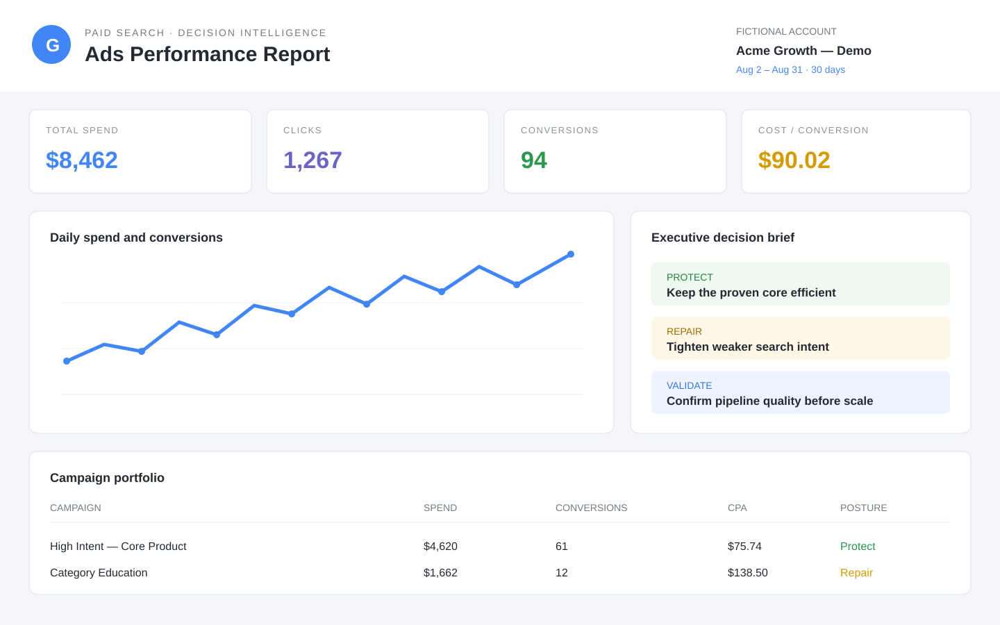
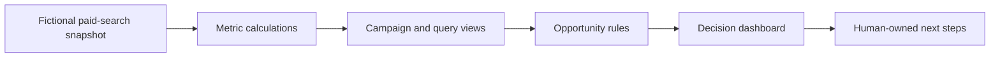

# Google Ads Growth Analyst

**A decision-focused Google Ads data system built to surface what deserves attention—without making uncontrolled account changes.**

This recruiter-facing prototype turns a fictional paid-search snapshot into a marketer-friendly decision dashboard. The goal is to help an operator spend less time assembling reports and more time deciding where to protect, fix, or scale.



> The screenshot and checked fallback dataset are synthetic. No client account identifiers, search terms, spend, or user emails are included in this public repository.

## The marketing problem

Google Ads data is easy to view but harder to operationalize. Conversion lag can make yesterday’s performance misleading, reporting pipelines can fail silently, and automated recommendations can move faster than a marketer’s confidence.

This system is designed around four practical questions:

| Operator question | System response |
|---|---|
| Is the data complete enough to use? | Clear reporting period and source labels |
| What changed versus the prior period? | Comparable spend, traffic, conversion, and efficiency metrics |
| Where is performance leaking? | Ranked search-term, keyword, campaign, budget, and rank opportunities |
| What should happen next? | A decision brief with protect, repair, and scale priorities |

## What I built

- **Decision dashboard:** spend, conversion efficiency, visibility loss, search-term waste, and campaign health in one operator view.
- **Deterministic opportunity rules:** candidates are generated from explicit thresholds before any AI or human interpretation.
- **Business-first recommendations:** the interface separates what to protect, what to repair, and what to validate before scaling.
- **Read-only posture:** the public prototype makes no account changes and contains no live account connection.

## System flow



## Business safeguards

- All public data is fictional and labeled as a portfolio snapshot.
- Recommendations remain separate from account execution.
- The dashboard calls out evidence and uncertainty before suggesting scale.
- Live credentials, account identifiers, sync jobs, and mutation logic are excluded.

## Current status

Working portfolio prototype of the read-only decision dashboard. The public repository intentionally omits live account sync, database migrations, deployment settings, credentials, and mutation infrastructure.

## Run the dashboard locally

Requirements: Node.js 22+ and pnpm.

```bash
cd site
pnpm install
pnpm dev
```

The dashboard always loads the included synthetic portfolio dataset.

## Repository guide

```text
site/                         Read-only decision dashboard
site/lib/google-ads-data.ts   Fictional portfolio dataset
assets/                       Inspectable SVG product preview
```

## Privacy and security

- No credentials or environment files are included.
- No live account connection or write-capable automation is included.
- Public demo data uses fictional account, campaign, keyword, and actor details.
- No client, employer, or confidential operational data is included.

## Stack

`TypeScript` · `React` · `Vinext` · `Recharts` · `Tailwind CSS`
