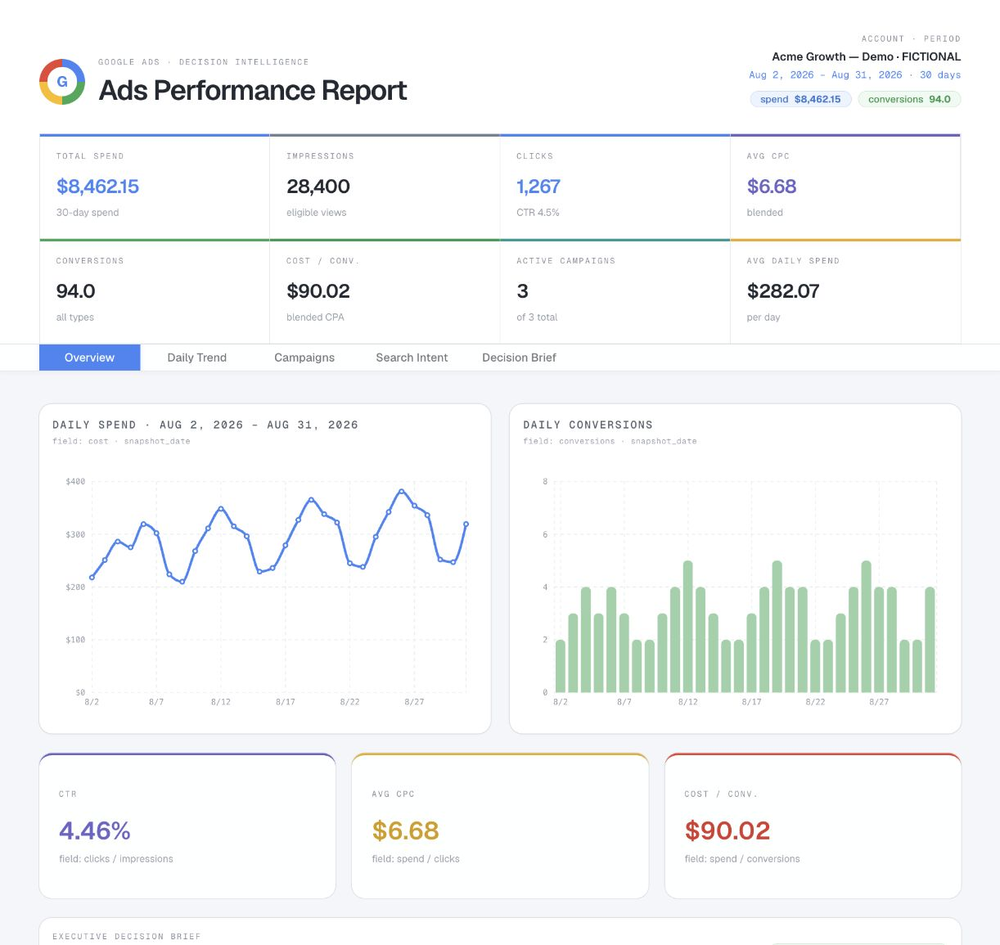
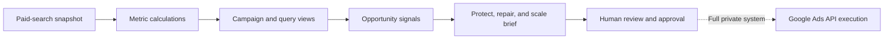
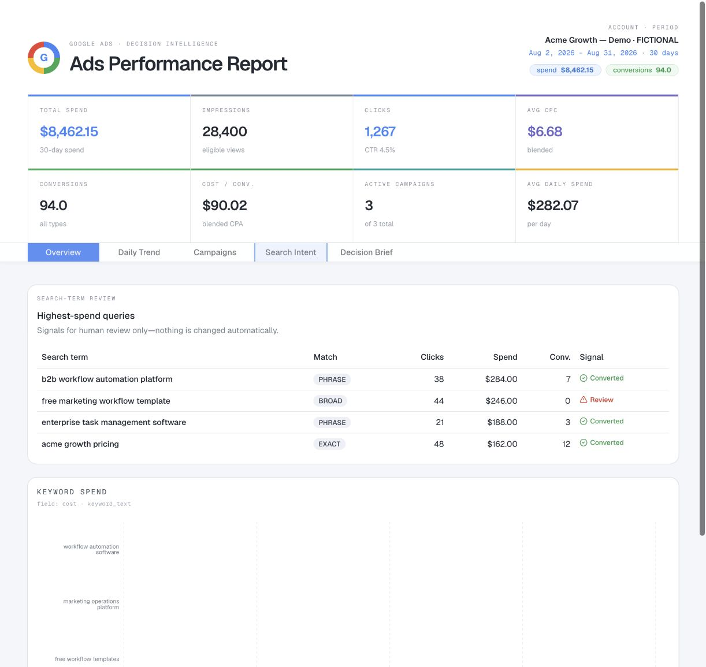
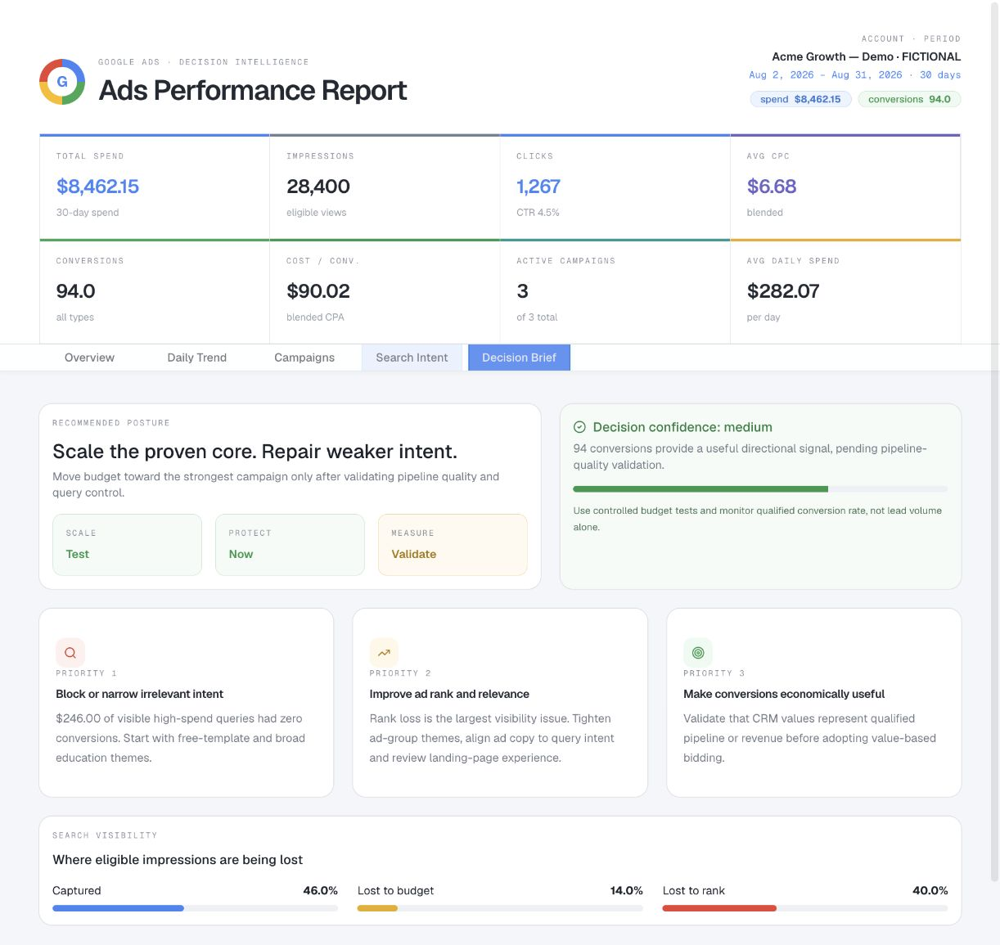

# Google Ads Growth Analyst

**Turn paid-search performance data into a clear protect, repair, and scale decision brief.**

This dashboard is designed for the part of Google Ads management that happens after reporting: deciding what deserves attention, what needs validation, and what should happen next. It brings performance, search intent, budget pressure, visibility loss, and recommended priorities into one operator view.



_Actual application screen using a completely fictional account and synthetic campaign data._

## What it does

The public application loads a safe demonstration snapshot and organizes it into five working views:

| View | What it helps answer |
|---|---|
| Overview | What happened across spend, traffic, conversions, CPA, and daily movement? |
| Daily Trend | Is delivery or response changing over time? |
| Campaigns | Which campaigns are carrying efficiency, volume, and visibility? |
| Search Intent | Which queries converted, and which high-spend terms deserve review? |
| Decision Brief | What should be protected, repaired, measured, or tested next? |

The dashboard calculates metrics such as CTR, average CPC, CPA, daily spend, and zero-conversion query spend. It also surfaces impression share lost to budget versus rank so the next action is tied to the actual constraint.

## From reporting to decisions



The full system is designed to send approved changes through the Google Ads API. This public version stops at recommendation and human review: it contains no OAuth credentials, customer IDs, live sync jobs, or write-capable mutation endpoints.

## Search-intent analysis

The search-term view separates converting intent from spend that needs a closer look. Nothing is changed automatically in the public application.



## Decision brief

The final view translates the visible signals into a marketer-owned operating posture: what to scale carefully, what to protect immediately, and what measurement questions must be resolved first.



## What is included

| Capability | Public repository |
|---|---|
| Interactive decision dashboard | Included |
| Daily, campaign, keyword, and search-term views | Included |
| Derived efficiency and visibility metrics | Included |
| Fictional demonstration dataset | Included |
| Recommendation and prioritization interface | Included |
| Live Google Ads account connection | Not included |
| OAuth credentials or customer identifiers | Never included |
| Approved-change execution | Not included in the public version |

## Install and run

### Requirements

- Node.js 22.13 or newer
- pnpm 11 or newer

No API key, environment file, database, or Google Ads account is required for the public demo.

### 1. Clone the project

```bash
git clone https://github.com/Jlopez-nava/google-ads-growth-analyst.git
cd google-ads-growth-analyst/site
```

### 2. Install dependencies

```bash
pnpm install
```

### 3. Start the dashboard

```bash
pnpm dev
```

Open [http://localhost:3000](http://localhost:3000). The synthetic account loads immediately, so you can explore every tab without connecting an external service.

## Use your own local sample data

The demonstration dataset lives in:

```text
site/lib/google-ads-data.ts
```

Replace the values in `snapshotData` with your own non-sensitive local sample, preserving the existing `DashboardData` shape. Do not commit real customer IDs, search terms, spend, user emails, or credentials.

## Build and verify

```bash
pnpm lint
pnpm exec tsc --noEmit
pnpm build
```

For a production preview after building:

```bash
pnpm exec vinext start
```

## Project map

```text
site/app/                               Application entry point and global styles
site/components/decision-dashboard.tsx Dashboard views and decision interface
site/lib/google-ads-data.ts             Typed fictional dataset
assets/                                 Real screenshots from the running app
```

## Data and safety boundaries

- Every account, campaign, keyword, query, date, and metric in the repository is fictional.
- The public application makes no outbound Google Ads requests.
- Recommendations remain separate from execution.
- No credentials, environment files, client data, or employer data are included.
- The screenshots above were captured directly from the running public application.

## Stack

`TypeScript` · `React` · `Vinext` · `Recharts` · `Tailwind CSS`
